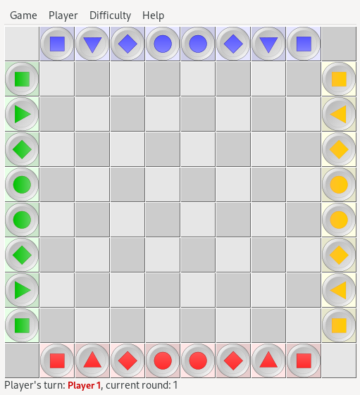

# Traverse

## Branches

### Master

This branch render UI inside a terminal.

I used libxml2 to save a game inside xml file.

### Gtk

This branch render UI inside a Gtk window.

I used libxml2 to save a game inside xml file.

---

## How to build

### Dependencies

- gcc
- gtk-devel
- libxml2-devel
- pkg-config

### Only two types of build

- release
- debug

Compile:

- for release : `make`
- for debug : `make debug`

---

## Notes

1. The game can run only on Linux:

    a. We use symbol and color to print into Unix Terminal. I try to adapt that for Windows terminal but brrr...

    b. The game save files under $HOME/.cache/traverse/ folder.

2. The game can be corrupted if the user changes XML files:

    a. I direct affect variables from XML file into runtime variables.

    b. I didn't verify the XML Structure. I'm sure how i saved XML Files, so normally got the same structure.

## Example

